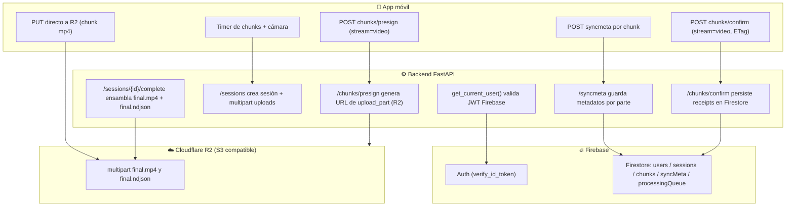
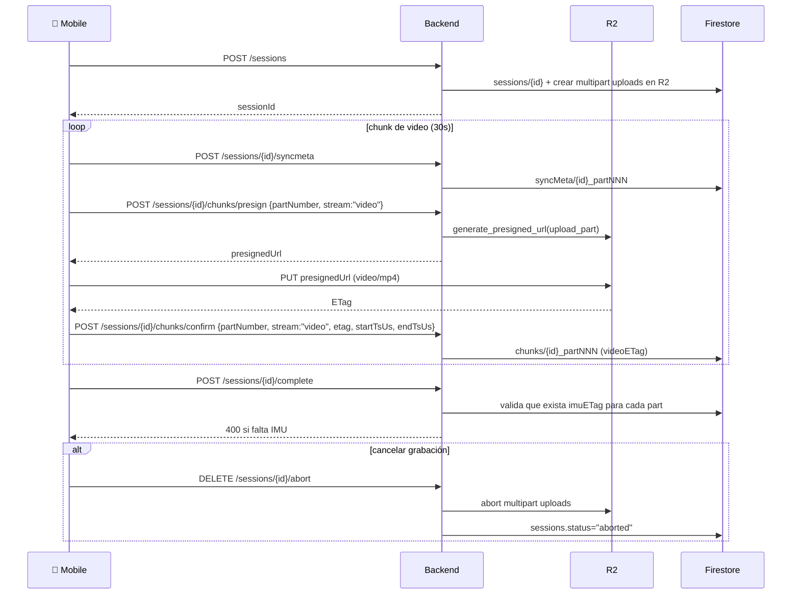

## Informe técnico: Backend Robonet (video por chunks + SyncMeta)

Este documento describe cómo el backend FastAPI coordina:
- **Chunks de video** (multipart) desde la app móvil hasta **Cloudflare R2**
- **Metadatos de sincronización** (`syncmeta`) por chunk de video (para que luego la Raspberry/worker pueda segmentar IMU)
- (Diseño para futuro) chunks de **IMU** usando el mismo patrón (presign/PUT/confirm), que hoy aún no está implementado en la app móvil

> Punto clave del diseño: **los binarios (chunks) nunca pasan por el backend**. El backend solo:
> - autentica y valida permisos/estado
> - genera **presigned URLs** para subir partes a R2
> - persiste metadata en **Firestore**
> - completa/aborta multipart uploads en R2 cuando corresponde

---

## Arquitectura general



---

## Start del backend (`app/main.py`)

- Inicializa logging con `setup_logging()` y logger de la app.
- En el `lifespan` (startup):
  - llama `init_firebase()` una sola vez
- Registra routers:
  - `/auth/*` -> `routers/auth.py`
  - `/sessions/*` -> `routers/sessions.py`
  - `/sessions/*` -> `routers/uploads.py` (chunks/presign/confirm/complete/abort)
  - `/sessions/*` -> `routers/sync_signals.py` (syncmeta)
- `CORS` está configurado con `allow_origins=["*"]`
- Endpoint:
  - `GET /health`

---

## Autenticación: Firebase ID Token

El backend usa `HTTPBearer` y `Authorization: Bearer <idToken>`.

Ruta protegida -> `get_current_user()` -> `verify_token()` con `firebase_admin.auth.verify_id_token`.

Si el token es inválido o expiró: responde **401**.

---

## Modelos persistidos en Firestore

### `users/{uid}`
Creado/actualizado desde el móvil en:
- `POST /auth/register-device`

### `sessions/{sessionId}`
Creado en:
- `POST /sessions`

Campos importantes:
- `status`: actualmente `"recording"` (el backend permite presign con `recording` o `uploading`, pero no hay un endpoint que setee `"uploading"` en este código)
- `videoKey`: `sessions/{sessionId}/video/final.mp4`
- `imuKey`: `sessions/{sessionId}/imu/final.ndjson`
- `videoUpload.uploadId`, `imuUpload.uploadId` (IDs de multipart upload en R2)

### `chunks/{chunkId}`
Creado/mergeado en:
- `POST /sessions/{session_id}/chunks/confirm`

`chunkId` = `"{sessionId}_part{partNumber:03d}"`

Contiene receipts con:
- `videoETag` / `videoStartTsUs` / `videoEndTsUs` (si stream=`video`)
- `imuETag` / `imuStartTsUs` / `imuEndTsUs` / `sensorIds` (si stream=`imu`)
- `status`:
  - `"videoUploaded"` si solo llegó video
  - `"imuUploaded"` si solo llegó imu
  - `"readyForProcess"` cuando existen ambos receipts (video+imu) para ese `partNumber` (POC de cola)

### `syncMeta/{syncId}`
Persistido en:
- `POST /sessions/{session_id}/syncmeta`

`syncId` = `"{sessionId}_part{partNumber:03d}"`

Contiene:
- ventana temporal del video del chunk: `videoStartTsUs`, `videoEndTsUs`
- ventana temporal del stream IMU asociada a ese chunk: `ptsStart`, `ptsEnd`
- `nonce` (opcional, hoy el móvil no lo envía)
- `consumedAt`, `consumedBy` (cuando la Raspberry lo consuma; hoy es POC)

### `processingQueue/{chunkId}` (POC)
Se crea cuando `confirmChunk` detecta que para ese `partNumber` ya existen receipts de:
- `videoETag` y `imuETag`

---

## Endpoints (detalle real del código)

### Docs / base
- Swagger: `/docs`
- ReDoc: `/redoc`
- Salud: `GET /health`

---

## Health

### `GET /health`
Sin auth.

Respuesta:
```json
{ "status": "ok", "env": "development" }
```

---

## Auth

### `POST /auth/register-device`
- Auth: **sí** (Bearer)
- Body: `RegisterDeviceRequest` (con `deviceInfo` opcional)
- Acción:
  - upsert en `users/{uid}` con `merge=True`
- Respuesta: `UserResponse`

### `GET /auth/me`
- Auth: **sí** (Bearer)
- Acción: lee `users/{uid}` y retorna `UserResponse`

---

## Sessions

### `POST /sessions`
- Auth: **sí** (Bearer)
- Body (`CreateSessionRequest`):
```json
{ "deviceInfo": { "...": "..." } }
```
- Acción:
  - genera `sessionId` (UUID)
  - abre **dos** multipart uploads en R2:
    - video (`video/mp4`) para `sessions/{sessionId}/video/final.mp4`
    - imu (`application/x-ndjson`) para `sessions/{sessionId}/imu/final.ndjson`
  - crea `sessions/{sessionId}` con `status="recording"`
- Respuesta: `SessionResponse`

### `GET /sessions`
- Auth: **sí** (Bearer)
- Acción: lista últimas 50 sesiones del usuario (`startedAt DESC`)

### `GET /sessions/{session_id}`
- Auth: **sí** (Bearer)
- Acción:
  - si no existe: **404**
  - si no pertenece al usuario: **403**
  - si pertenece: retorna `SessionResponse`

---

## Chunks (multipart en R2)

Este backend usa multipart upload en R2, pero el backend **no sube los bytes**:
- genera presigned URL para `upload_part`
- el móvil sube bytes con `PUT`
- el móvil manda de vuelta el `ETag` con `chunks/confirm`

### `POST /sessions/{session_id}/chunks/presign`
- Auth: **sí** (Bearer)
- Body (`PresignRequest`):
```json
{ "partNumber": 1, "stream": "video" }
```
- Acción:
  - valida que la sesión exista y sea del usuario
  - verifica estado grabable: `session.status in {"recording","uploading"}`
  - si `stream == "video"` usa:
    - `session["videoKey"]`
    - `session["videoUpload"]["uploadId"]`
  - si `stream == "imu"` usa:
    - `session["imuKey"]`
    - `session["imuUpload"]["uploadId"]`
  - genera presigned URL para `upload_part` con expiración **2 horas** (`ExpiresIn=7200`)
- Respuesta (`PresignResponse`):
```json
{
  "uploadId": "string",
  "partNumber": 1,
  "stream": "video",
  "presignedUrl": "https://..."
}
```

### PUT del móvil a R2
- El móvil hace `PUT` directo a `presignedUrl`.
- Espera `ETag` en la respuesta.
- Para video, el móvil usa `Content-Type: video/mp4`.

### `POST /sessions/{session_id}/chunks/confirm`
- Auth: **sí** (Bearer)
- Body (`ConfirmChunkRequest`):
```json
{
  "partNumber": 1,
  "stream": "video",
  "etag": "\"...\"",
  "startTsUs": 1712345678901234,
  "endTsUs": 1712345682901234,
  "sensorIds": null
}
```
- Acción:
  - arma `chunkId = {sessionId}_part{partNumber:03d}`
  - persiste/mergea en `chunks/{chunkId}`:
    - si stream=`video`: guarda `videoETag`, `videoStartTsUs`, `videoEndTsUs`, `videoUploadedAt`
    - si stream=`imu`: guarda `imuETag`, `imuStartTsUs`, `imuEndTsUs`, `sensorIds`, `imuUploadedAt`
  - calcula `status`:
    - si tras el merge existen ambos ETags (video+imu) -> `readyForProcess` y crea `processingQueue/{chunkId}` (POC)
    - si solo llegó video -> `videoUploaded`
    - si solo llegó imu -> `imuUploaded`
- Respuesta (`ConfirmChunkResponse`):
```json
{ "chunkId": "session_part001", "status": "videoUploaded|imuUploaded|readyForProcess" }
```

### `GET /sessions/{session_id}/chunks`
- Auth: **sí** (Bearer)
- Acción: devuelve docs `chunks` de la sesión ordenados por `partNumber`

### `POST /sessions/{session_id}/complete`
- Auth: **sí** (Bearer)
- Acción:
  - carga todos los `chunks` confirmados
  - exige que **cada parte** tenga `videoETag` e `imuETag`
  - llama `complete_multipart_upload()` para:
    - `final.mp4` (usando `videoETag`)
    - `final.ndjson` (usando `imuETag`)
  - actualiza `sessions/{sessionId}` a:
    - `status="complete"`
    - `endedAt=now`
    - `totalChunks=#chunks`
- Error:
  - **400** si faltan receipts (común cuando el móvil aún no sube IMU)

### `DELETE /sessions/{session_id}/abort`
- Auth: **sí** (Bearer)
- Acción:
  - aborta ambos multipart uploads (video+imu) en R2
  - actualiza `sessions/{sessionId}` a `status="aborted"`, `endedAt=now`
  - recomendado al cancelar grabación

---

## SyncMeta (sincronización de chunk video -> ventana IMU)

### `POST /sessions/{session_id}/syncmeta`
- Auth: **sí** (Bearer)
- Body (`SyncMetaRequest`):
```json
{
  "partNumber": 1,
  "videoStartTsUs": 1712345678901234,
  "videoEndTsUs": 1712345682901234,
  "ptsStart": 0,
  "ptsEnd": 30000,
  "nonce": null
}
```
- Acción:
  - guarda `syncMeta/{syncId}` con `consumedAt=None`
- Respuesta:
```json
{ "syncId": "...", "status": "stored" }
```

### `GET /sessions/{session_id}/syncmeta/pending` (POC)
- Auth: **sí** (Bearer)
- Acción: devuelve hasta 50 `syncMeta` con `consumedAt == None` (polling)

### `POST /sessions/{session_id}/syncmeta/{part_number}/consume` (POC)
- Auth: **sí** (Bearer)
- Acción: marca `syncMeta/{syncId}` como consumido

---

## Flujo completo en el móvil (lo que SÍ hace hoy)

La app móvil:
1. Crea sesión: `POST /sessions`
2. Cada `_chunkDurationSeconds = 30`:
   - guarda `syncmeta` con ventana del video del chunk
   - pide `chunks/presign` para `stream:"video"`
   - sube el chunk a R2 con `PUT` directo
   - confirma con `chunks/confirm` (stream:"video" + `etag`)
3. Al detener:
   - intenta `POST /sessions/{id}/complete`
   - puede fallar si faltan receipts de IMU (porque hoy no se suben chunks IMU desde el móvil)
4. Al cancelar:
   - `DELETE /sessions/{id}/abort`



---

## Coordinación con el móvil (`lib/main.dart`, `AppShell`, `SessionScreen`)

### `lib/main.dart`
- Inicializa Firebase y localización.
- Home: `LoginScreen`.

### `LoginScreen` / `AuthService`
- Firma con Google (Firebase).
- Obtiene `idToken`.
- Llama `POST /auth/register-device` para que el backend cree/actualice `users/{uid}`.
- Luego navega a `AppShell`.

### `AppShell`
- Muestra `SessionScreen` en la barra inferior.

### `SessionScreen` / `_RecordingRoute`
- Al presionar iniciar:
  - pide permisos (camera/microphone)
  - inicializa `RecordingService`
  - llama `POST /sessions` y obtiene `sessionId`
  - navega a `_RecordingRoute`
- `_RecordingRoute`:
  - arranca grabación
  - cada 30s rota chunks (partNumber empieza en 1)
  - por chunk ejecuta:
    - `POST /syncmeta`
    - `POST /chunks/presign` (stream video)
    - `PUT` a R2
    - `POST /chunks/confirm` (stream video)

---

## Qué falta para completar el flujo “video + IMU”

Para que `POST /sessions/{session_id}/complete` funcione:
1. El móvil debe implementar captura de IMU y escribir chunks IMU con el mismo `partNumber` que el video.
2. Por cada chunk IMU:
   - `POST /sessions/{id}/chunks/presign` con `stream:"imu"`
   - `PUT` directo a R2 usando la `presignedUrl`
   - leer `ETag`
   - `POST /sessions/{id}/chunks/confirm` con `stream:"imu"`, `etag`, `startTsUs`, `endTsUs` (y `sensorIds` si aplica)

Cuando existan receipts de video e IMU para cada parte:
- `confirmChunk` marcará `readyForProcess` y creará `processingQueue` (POC)
- `completeSession` podrá ensamblar:
  - `sessions/{id}/video/final.mp4`
  - `sessions/{id}/imu/final.ndjson`

