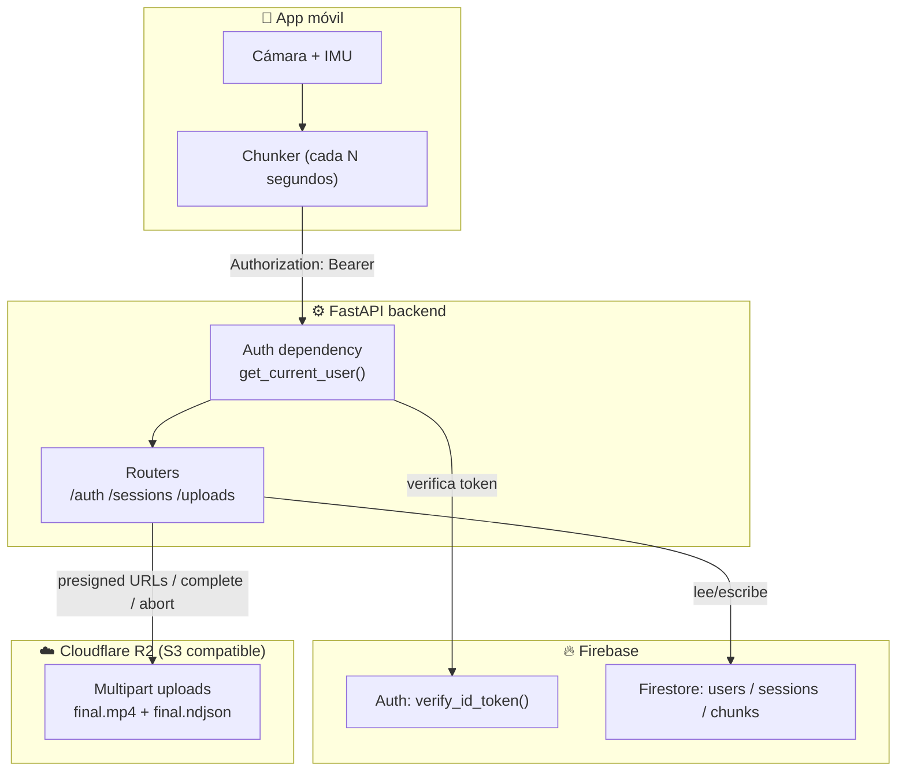
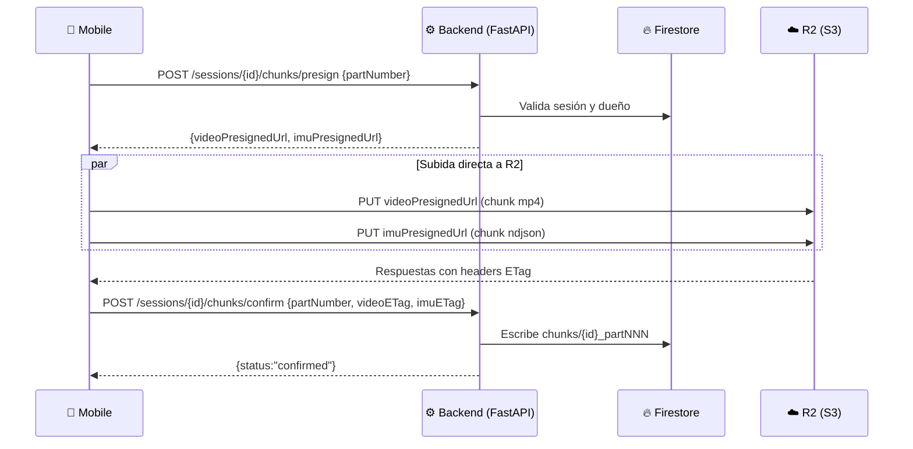
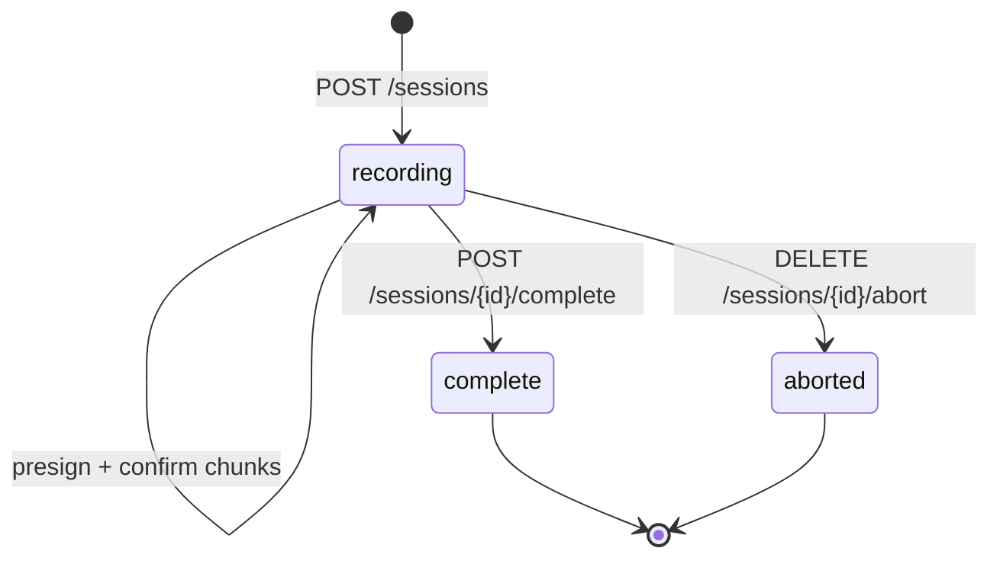

## Informe técnico: Backend Robonet (Video + IMU Streaming)

Backend en **Python + FastAPI** que coordina el streaming (por chunks) de **video** (`.mp4`) e **IMU** (`.ndjson`) desde la app móvil hacia:

- **Cloudflare R2**: guarda los archivos (multipart upload).
- **Firebase Firestore**: guarda metadata (sesiones, chunks, usuarios) y estados.
- **Firebase Auth**: autentica al usuario (ID Token).

> Punto clave: **los archivos nunca pasan por el backend**. El backend solo genera **presigned URLs**, valida permisos y persiste metadata.

---

## Arquitectura general



---

## Estructura del proyecto (backend)

Carpetas/archivos importantes en `backend/app/`:

- **`main.py`**: crea la app FastAPI, configura CORS, registra routers y hace `startup()` (inicializa Firebase).
- **`config.py`**: variables de entorno centralizadas (`Settings`) + helpers para credenciales de Firebase.
- **`dependencies.py`**: auth (extrae `Authorization: Bearer ...` y valida token).
- **`routers/auth.py`**: endpoints de usuario/dispositivo.
- **`routers/sessions.py`**: endpoints de creación y consulta de sesiones.
- **`routers/uploads.py`**: endpoints de presign/confirm/complete/abort de chunks.
- **`services/firebase.py`**: `init_firebase()`, `get_db()` (Firestore), `verify_token()` (Firebase Auth).
- **`services/r2.py`**: wrapper boto3 para R2 (multipart + presigned).
- **`models/*.py`**: modelos Pydantic de request/response.

---

## Autenticación (Firebase ID Token)

La app móvil autentica al usuario directamente con Firebase Auth y obtiene un **ID Token** (JWT).  
En **cada request** al backend se manda:

- **Header**: `Authorization: Bearer <idToken>`

En el backend:

- `app/dependencies.py:get_current_user()` usa `app/services/firebase.py:verify_token()` para validar el token.
- Si falla: responde **401** con detalle legible (token expirado/ inválido/ error).

---

## “Base de datos” en este backend (Firestore)

Este proyecto usa Firestore como DB de metadata (no guarda binarios). Las colecciones y sus documentos se construyen desde los routers.

### Colección `users`

**Documento**: `users/{uid}` (uid viene del token Firebase)

**Se escribe/actualiza en**: `POST /auth/register-device`  
**Se lee en**: `GET /auth/me`

Campos típicos:

| Campo | Tipo | Descripción |
|------|------|-------------|
| `uid` | string | UID de Firebase |
| `email` | string | Email del token (si existe) |
| `displayName` | string | Nombre del token (si existe) |
| `deviceInfo` | object | Info del dispositivo (platform/model/os/appVersion) |
| `createdAt` | datetime | Timestamp |
| `updatedAt` | datetime | Timestamp |

### Colección `sessions`

**Documento**: `sessions/{sessionId}` (`sessionId` es UUID generado por backend)

**Se crea en**: `POST /sessions`  
**Se lista en**: `GET /sessions`  
**Se consulta en**: `GET /sessions/{sessionId}`  
**Se actualiza en**: `POST /sessions/{sessionId}/complete`, `DELETE /sessions/{sessionId}/abort`

Campos (según `routers/sessions.py` + `models/session.py`):

| Campo | Tipo | Descripción |
|------|------|-------------|
| `sessionId` | string | UUID |
| `userId` | string | UID dueño |
| `status` | string | `"recording"` → `"complete"`/`"aborted"` (y potencialmente `"uploading"`) |
| `startedAt` | datetime | Inicio |
| `endedAt` | datetime \| null | Fin (si terminó/abortó) |
| `videoKey` | string | Ruta en R2 (ej. `sessions/{id}/video/final.mp4`) |
| `imuKey` | string | Ruta en R2 (ej. `sessions/{id}/imu/final.ndjson`) |
| `videoUpload.uploadId` | string | UploadId multipart de R2 |
| `imuUpload.uploadId` | string | UploadId multipart de R2 |
| `deviceInfo` | object | Metadata enviada al crear la sesión |
| `summary` | object | Reservado para resumen/post-procesamiento |
| `totalChunks` | int \| null | Se setea al completar |

> Nota: en el modelo existe `completedParts`, pero actualmente el flujo guarda los parts confirmados en `chunks/` y reconstruye la lista al completar.

### Colección `chunks`

**Documento**: `chunks/{chunkId}` con `chunkId = "{sessionId}_part{NNN}"` (ej. `..._part001`)

**Se crea en**: `POST /sessions/{sessionId}/chunks/confirm`  
**Se lee (para completar) en**: `POST /sessions/{sessionId}/complete`

Campos (según `routers/uploads.py` + `models/chunk.py`):

| Campo | Tipo | Descripción |
|------|------|-------------|
| `chunkId` | string | ID compuesto (sesión + parte) |
| `sessionId` | string | FK lógica a `sessions/{sessionId}` |
| `partNumber` | int | Número de parte (1-based) |
| `videoETag` | string | ETag devuelto por R2 al subir la parte de video |
| `imuETag` | string | ETag devuelto por R2 al subir la parte IMU |
| `uploadedAt` | datetime | Timestamp |
| `status` | string | `"uploaded"` |

---

## Storage (Cloudflare R2) y multipart upload

El backend trabaja con R2 vía `boto3` (API S3):

- **create**: `create_multipart_upload(key, content_type) -> uploadId`
- **upload part**: el backend genera una **presigned URL** para `upload_part`
- **complete**: `complete_multipart_upload(key, uploadId, parts)`
- **abort**: `abort_multipart_upload(key, uploadId)`
- (extra) **download**: `generate_presigned_get_url(key)`

Claves finales usadas por el backend:

- Video: `sessions/{sessionId}/video/final.mp4`
- IMU: `sessions/{sessionId}/imu/final.ndjson`

---

## Endpoints disponibles (qué hacen y qué se envía)

Base URL típica: `http://localhost:8000`  
Docs automáticas: `/docs` y `/redoc`

### Health

#### `GET /health`

- **Auth**: no
- **Respuesta**:

```json
{ "status": "ok", "env": "development" }
```

### Auth / usuario

#### `POST /auth/register-device`

- **Auth**: sí (Bearer Firebase ID Token)
- **Body** (`RegisterDeviceRequest`):

```json
{
  "deviceInfo": {
    "platform": "android",
    "model": "Pixel 7",
    "osVersion": "14",
    "appVersion": "1.0.0"
  }
}
```

- **Qué hace**:
  - Upsert en `users/{uid}` con `merge=True` (no pisa campos existentes).
- **Respuesta** (`UserResponse`): perfil del usuario (con `deviceInfo`, timestamps, etc.).

#### `GET /auth/me`

- **Auth**: sí
- **Qué hace**:
  - Lee `users/{uid}` y lo devuelve; si no existe, devuelve mínimo `{uid, email}`.
- **Respuesta** (`UserResponse`).

### Sessions

#### `POST /sessions`

- **Auth**: sí
- **Body** (`CreateSessionRequest`):

```json
{
  "deviceInfo": { "any": "json" }
}
```

- **Qué hace**:
  - Genera `sessionId` (UUID).
  - Define `videoKey` y `imuKey`.
  - Abre **dos** multipart uploads en R2 (video e IMU) y guarda sus `uploadId`.
  - Crea documento `sessions/{sessionId}` con `status="recording"`.
- **Respuesta** (`SessionResponse`) con keys + uploadIds.

#### `GET /sessions`

- **Auth**: sí
- **Qué hace**:
  - Lista hasta 50 sesiones del usuario (`where userId == uid`) ordenadas por `startedAt DESC`.
- **Respuesta**: `SessionResponse[]`.

#### `GET /sessions/{session_id}`

- **Auth**: sí
- **Qué hace**:
  - Devuelve la sesión si existe y pertenece al usuario; si no:
    - **404** si no existe
    - **403** si no es el dueño
- **Respuesta**: `SessionResponse`.

### Uploads / chunks

#### `POST /sessions/{session_id}/chunks/presign`

- **Auth**: sí
- **Body** (`PresignRequest`):

```json
{ "partNumber": 1 }
```

- **Qué hace**:
  - Valida que la sesión exista y sea del usuario.
  - Verifica que `status` esté en `{ "recording", "uploading" }`.
  - Genera 2 presigned URLs: una para **video part** y otra para **IMU part**.
- **Respuesta** (`PresignResponse`):

```json
{
  "uploadId": "string",
  "videoPresignedUrl": "https://...",
  "imuPresignedUrl": "https://...",
  "partNumber": 1
}
```

> Importante: el móvil sube con `PUT` directo a R2 y debe leer el header **`ETag`** de la respuesta de R2.

#### `POST /sessions/{session_id}/chunks/confirm`

- **Auth**: sí
- **Body** (`ConfirmChunkRequest`):

```json
{
  "partNumber": 1,
  "videoETag": "\"etag-video\"",
  "imuETag": "\"etag-imu\""
}
```

- **Qué hace**:
  - Crea/actualiza el documento `chunks/{sessionId}_partNNN` con ETags y metadata.
- **Respuesta** (`ConfirmChunkResponse`):

```json
{ "chunkId": "session_part001", "status": "confirmed" }
```

#### `POST /sessions/{session_id}/complete`

- **Auth**: sí
- **Qué hace**:
  - Lee todos los `chunks` de esa sesión ordenados por `partNumber`.
  - Construye `parts = [{"PartNumber": n, "ETag": "..."}]` para video e IMU.
  - Llama `complete_multipart_upload()` para ambos objetos finales.
  - Actualiza `sessions/{sessionId}` a:
    - `status="complete"`
    - `endedAt=now`
    - `totalChunks=len(chunks)`
- **Errores**:
  - **400** si no hay chunks confirmados.
- **Respuesta** (`CompleteSessionResponse`):

```json
{ "sessionId": "uuid", "status": "complete", "chunks": 12 }
```

#### `DELETE /sessions/{session_id}/abort`

- **Auth**: sí
- **Qué hace**:
  - Aborta ambos multipart uploads (video e IMU) para no dejar partes huérfanas.
  - Marca `sessions/{sessionId}` como `status="aborted"` y setea `endedAt`.
- **Respuesta**:

```json
{ "status": "aborted" }
```

---

## Flujo completo de un chunk (paso a paso)



---

## Estados de sesión (modelo mental)

El código usa estos estados directamente:

- **`recording`**: sesión activa (se pueden pedir presigns).
- **`uploading`**: permitido por backend para presign (útil si la app separa “grabación” vs “subida”).
- **`complete`**: sesión cerrada y ensamblada en R2.
- **`aborted`**: sesión cancelada; multipart uploads abortados.



---

## Configuración (Settings / .env)

Variables soportadas por `app/config.py`:

- **Firebase**
  - `FIREBASE_CREDENTIALS_PATH` (dev): ruta al JSON.
  - `FIREBASE_CREDENTIALS_B64` (prod/CI): JSON en base64; el backend lo decodifica y crea un archivo temporal para `firebase-admin`.
- **R2**
  - `R2_ACCOUNT_ID`, `R2_ACCESS_KEY_ID`, `R2_SECRET_ACCESS_KEY`, `R2_BUCKET_NAME`
  - `R2_ENDPOINT` es opcional; si no se define y hay `R2_ACCOUNT_ID`, se construye como `https://{account_id}.r2.cloudflarestorage.com`.
- **App**
  - `APP_ENV` (default `development`)
  - `CHUNK_DURATION_SECONDS` (default 30)

---

## Checklist de integración móvil (mínimo)

- **Auth**
  - Loguear con Firebase Auth.
  - Enviar `Authorization: Bearer <idToken>` en todas las llamadas al backend.
- **Sesión**
  - `POST /sessions` al empezar.
- **Chunks**
  - Repetir por cada chunk:
    - `POST /sessions/{id}/chunks/presign`
    - `PUT` video + IMU a R2 (usar las URLs)
    - Leer `ETag` de cada `PUT`
    - `POST /sessions/{id}/chunks/confirm`
- **Final**
  - `POST /sessions/{id}/complete` al terminar.
  - Si el usuario cancela: `DELETE /sessions/{id}/abort`

